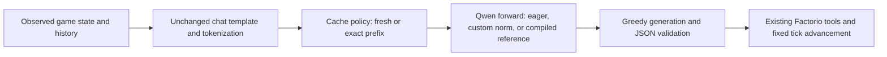

# Inference acceleration design

Design dated October 6, 2026. Guarded RMSNorm dispatch and the eager/custom/compiled offline comparison are implemented. The [K02 result](../outputs/K02%20-%20RMSNorm%20-%20Integrated%20Inference%20Results.md) records numerical diagnostics, identical tokens/actions on five saved states and warm complete-response measurements. The maintenance runner defaults to original PyTorch and exposes an opt-in custom backend; no new gameplay episode was run. Exact-prefix reuse remains proposed.

## Purpose and mental model

The project needs faster repeated model decisions while preserving the task and the information available to the agent. A decision has several costs: assembling and tokenizing a prompt, processing that prompt on the GPU, generating tokens, decoding and validating the action, and communicating with Factorio. An improvement to one cost does not establish an equal improvement to the complete response or episode.

K02 changes how Qwen computes normalization. A subsequent cache experiment changes how much unchanged prompt content Qwen recomputes. Context compression and fine-tuning change the information or learned policy and belong to separate comparisons. This separation makes an observed speedup interpretable.

The intended flow is:

The cache policy decides which input tokens need computation. The forward backend decides how that computation executes. Neither component adds observations or changes the game clock. Experiments run sequentially against one world; parallel serving is outside this design.

## Baselines and comparison order

The planned comparison keeps the pinned Qwen revision, BF16 weights, SDPA attention, chat template, prompts, greedy decoding, stopping rule and token budgets fixed. The existing limits are 8,192 total tokens and 256 generated tokens. Loading, extension build time and compiler warm-up are recorded separately from warm latency.

| Condition | Normalization and execution | Cross-decision prefix reuse | Question |
| --- | --- | --- | --- |
| Eager reference | Original Qwen forward | Off | What does the current application cost? |
| Custom RMSNorm | Original forward with supported normalization calls routed to our extension | Off | Does the kernel improve application latency? |
| Compiled reference | Original normalization with `torch.compile` around the model forward | Off | How does the custom path compare with an optimized existing implementation? |
| Prefix-cache pair | One fixed, validated backend, measured both ways | Off versus on | Does reusing identical prefix tokens save time after accounting for cache handling? |

The compiled reference is required as a stronger baseline. Its usefulness must be measured on the installed PyTorch 2.11.0/Transformers 4.57.6 environment. It is not assumed to be faster. Begin with Inductor's default mode and the same attention and generation code; record settings, graph breaks, recompilations and memory. If dynamic-cache compilation cannot produce a usable baseline, document the failure and compare static-cache eager versus static-cache compiled as an explicitly separate matched pair. Do not attribute a cache-layout change to compilation alone.

Compiling the custom extension together with the model is an optional later combination. The current pybind entry point does not establish compiler compatibility. PyTorch's [custom-operator workflow](https://docs.pytorch.org/tutorials/advanced/cpp_custom_ops.html) describes dispatcher and fake-tensor registration needed for that work. Use its concepts while checking actual APIs against our pinned runtime; do not upgrade dependencies to make a comparison succeed without creating a separately named condition.

## RMSNorm integration contract

The adapter operates on one loaded model instance. It identifies the exact `Qwen3RMSNorm` class and the full-width layer paths: each decoder's `input_layernorm` and `post_attention_layernorm`, plus `model.norm`. Attention `q_norm` and `k_norm` remain on their original implementation. The [pinned Transformers source](https://github.com/huggingface/transformers/blob/v4.57.6/src/transformers/models/qwen3/modeling_qwen3.py) defines these locations. Determine the actual layer count from the loaded configuration and record eligible, replaced and untouched module names; do not assume a count from another Qwen model.

Save each original bound forward method, retain the existing module and weight parameter, and install an instance-local dispatch wrapper. This preserves state-dictionary names and permits explicit restoration. Avoid a process-wide class patch or edits to installed Transformers. Construct compiled-reference callables from the original backend rather than reusing a callable traced while custom dispatch was active.

Before inference, set the model to evaluation mode and freeze parameters with `requires_grad_(False)` for every inference condition. The native binding rejects weights requiring gradients; evaluation mode alone does not change that flag. Enter `torch.inference_mode()` for forward/generation. This is an inference-only setup. A future training experiment must restore the original backend and establish its own trainable parameters and autograd behavior.

At a supported call the wrapper sends the unchanged input, existing weight and module epsilon to `rmsnorm_forward`. The native implementation remains the authority for validation. The adapter mirrors its contract to choose the path before launching:

| Requirement | Custom path |
| --- | --- |
| Module and mode | Approved full-width Qwen norm; evaluation/inference with no required gradients |
| Input | Strided, contiguous BF16 CUDA tensor, at least one dimension, last dimension 2,560; no unresolved negative view |
| Weight | Strided, contiguous BF16 `[2560]`, on the input device, no unresolved negative view or required gradients |
| Epsilon | Finite in `(0, 1]`, remaining a positive normal FP32 value after conversion |
| Workload | At most 8,192 total rows; an empty input returns without a kernel launch |

A supported call uses the reviewed current-stream kernel. A known unsupported input uses the saved original forward and records a reason. Do not insert an implicit contiguous copy or precision conversion to manufacture support. Extension load failure, a failed native-review gate, or a CUDA runtime error stops a requested custom run; these are not fallback cases. A custom condition must show that supported calls actually reached the extension.

Coverage diagnostics record module names, input shapes, dispatch counts and fallback reasons outside the timed path. Measure the ordinary wrapper overhead with logging disabled. Native edits, dispatcher changes or additional project-authored native sources require a fresh full source review and matching validation. Existing hashes and K01 evidence remain intact.

## Exact-prefix cache reuse

The existing runner calls `generate()` on the assembled prompt for each decision. Generation can cache tokens inside that call; the runner does not explicitly retain a reusable cache between decisions. The proposed optimization starts with the stable system/tool prefix, which remains useful even when old conversation pairs are trimmed.

Tokenize the complete prompt using the existing chat template first. A reusable prefix is an exact leading token-ID sequence of that complete prompt, not merely similar text. Cache identity includes model revision/backend, tokenizer and chat-template identity, device/dtype, positional settings and prefix token IDs. On a mismatch or unsupported cache configuration, perform a fresh forward and record the miss. Do not independently tokenize a guessed text boundary and assume it matches the complete prompt.

Prefill the stable prefix once, retain a pristine cache, and give each response an independent working copy or another proven nonmutating reuse mechanism. `generate()` mutates working state; retaining an already extended cache as the next response's stable prefix would leak history or duplicate tokens. Include copy/reset overhead and persistent GPU memory in the comparison. The cache cannot mix backends or episodes, and history trimming must not reuse stale positional state.

Pass only uncached suffix tokens for the forward work while preserving the same full logical input for output slicing and the JSON stopping rule. Masks cover cached plus new tokens; cache positions continue from the actual prefix length. Hugging Face's [cache explanation](https://huggingface.co/docs/transformers/v4.57.1/en/cache_explanation) explains these dependencies. The exact adapter remains to be implemented and verified against installed 4.57.6 behavior. A changed system prompt, tool description, memory insertion inside the prefix, model backend or positional policy invalidates the entry.

## Correctness and performance protocol

Every new validation begins with the full native source inspection and exact-hash gate required by [CONVENTIONS.md](../CONVENTIONS.md), followed by matching bounded operator checks. The existing operator thresholds remain `rtol=0.02`, `atol=1e-5`; these are operator thresholds, not an established whole-model logit tolerance.

Freeze a prompt manifest from retained maintenance traces before timing: early short prompts, a full carrying inventory, near-expired fuel, repeated invalid actions and late prompts near the context limit. Record prompt hashes, token counts and source IDs. Validate all candidate backends on those same inputs: finite logits, maximum/mean absolute logit differences, reference next-token margins, exact greedy token agreement, valid JSON and exact parsed action agreement. The first K02 acceptance gate requires finite logits and identical greedy tokens/actions on the fixed manifest; logit differences are diagnostic measurements. An unexplained token/action disagreement blocks an equivalence claim and live integration; keep it as a finding. Any additional model-level numerical threshold must be declared before candidate scoring rather than copied from K01.

Two timing views answer different questions. A fixed-work replay supplies the same continuation token IDs and measures equal prefill/decode workloads. A normal greedy response measures actual completion and action behavior, with output token counts alongside latency. The replay is an inference timing diagnostic; its forced tokens are not agent decisions.

| Measurement | Boundary |
| --- | --- |
| Prefill GPU time | Prompt or uncached-suffix forward work; cached and uncached token counts recorded |
| Decode GPU time | Equal fixed-count continuation forwards and per-token distribution |
| Time to first token | Request start through the first generated token, including CPU and prefill work |
| Complete response latency | Prompt assembly/tokenization through decode and validated JSON |
| Episode wall time | Full evaluation including game/tool work; setup/loading separate |
| Resource/cold costs | Peak allocated and reserved GPU memory, prefix-cache storage, extension build, compilation and warm-up |

CUDA events measure GPU segments; a monotonic CPU clock with synchronization at response boundaries measures wall time. Do not synchronize after every generated token in the natural-response measurement. Keep per-forward instrumentation in the diagnostic replay. Preserve the original timer as a separately named legacy boundary so it is not confused with complete response latency.

After correctness passes, use ten warm-ups and three blocks of 30 paired complete responses per frozen prompt, alternating backend order. Include raw samples, median, p95, within-block ratios, output lengths, compilation events and coverage. Timed inference runs have no other experimental GPU workload. Repeated timing samples estimate runtime variation; they do not create independent gameplay fixtures.

Only after offline equivalence checks may matched backends execute the same frozen maintenance fixtures. Retain the exact decision cadence, histories and limits. Compare plate production, failures, survival and total wall time separately. A faster backend receives no extra simulated reaction time because the game pauses during inference.

## Implementation and evidence boundary

The implemented `tools/qwen_rmsnorm_backend.py` adapter is independently importable, with an explicit installation/restoration API and documented failure contract. The shared inference layer should own tokenization, generation and timings; the game adapter should retain its existing validation and tick rules. Runtime storage remains configurable through `FACTORIO_PILOT_HOME`; source locations resolve against the selected checkout. Add code docstrings and relevant tests with that implementation, preserving frozen snapshots.

Guarded RMSNorm dispatch, offline validation/timing and the compiled reference now have [K02 evidence](../outputs/K02%20-%20RMSNorm%20-%20Integrated%20Inference%20Results.md). The offline harness measures warm complete-response distributions and single diagnostic prefill/eight-token decode segments. Warm GPU phase distributions, time to first token and matched live episodes remain unmeasured. Exact-prefix reuse is the next separately identified implementation; a combined condition requires individual component evidence. A later cache report receives the next kernel/performance-stage number and distinct run IDs according to [Continuing the study](Continuing%20the%20Study.md).

Fine-tuning remains a separate proposal. Successful inference optimization can reveal available time and memory, but the custom forward-only kernel supplies no backward pass and establishes no training speedup. Training would need a dataset, held-out fixtures, an unchanged-model baseline and a recorded memory budget. This document does not schedule or authorize those runs.
